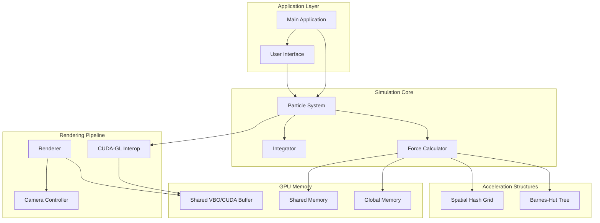

# Design Document: N-Body Particle Simulation System

## Overview

本设计文档描述了一个超大规模 N-Body 粒子仿真系统的架构和实现细节。系统采用 CUDA 进行 GPU 并行计算，支持直接 O(N²) 算法和 Barnes-Hut O(N log N) 加速算法，并通过 CUDA-OpenGL 互操作实现零拷贝实时可视化。

### Design Goals

1. **高性能**: 支持百万级粒子实时仿真
2. **可扩展**: 模块化设计，易于添加新的力计算方法
3. **零拷贝**: 计算与渲染共享 GPU 内存
4. **用户友好**: 实时可视化与交互控制

## Architecture



## Components and Interfaces

### 1. Particle System (ParticleSystem)

核心数据管理组件，采用 Structure of Arrays (SoA) 布局优化内存访问。

```cpp
// 粒子数据结构 - SoA 布局
struct ParticleData {
    // 位置数组
    float* pos_x;
    float* pos_y;
    float* pos_z;
    
    // 速度数组
    float* vel_x;
    float* vel_y;
    float* vel_z;
    
    // 加速度数组 (用于 Verlet 积分)
    float* acc_x;
    float* acc_y;
    float* acc_z;
    
    // 质量数组
    float* mass;
    
    size_t count;
};

class ParticleSystem {
public:
    void initialize(size_t particle_count, InitDistribution dist);
    void update(float dt);
    void reset();
    
    ParticleData* getDeviceData();
    size_t getParticleCount() const;
    
    void setForceMethod(ForceMethod method);
    void setGravitationalConstant(float G);
    
    void saveState(const std::string& filename);
    void loadState(const std::string& filename);
    
private:
    ParticleData d_particles;  // Device memory
    ForceCalculator* force_calculator;
    Integrator* integrator;
    CudaGLInterop* interop;
};
```

### 2. Force Calculator (ForceCalculator)

力计算模块，支持多种算法切换。

```cpp
enum class ForceMethod {
    DIRECT_N2,      // O(N²) 直接计算
    BARNES_HUT,     // O(N log N) 树算法
    SPATIAL_HASH    // O(N) 空间哈希
};

class ForceCalculator {
public:
    virtual void computeForces(ParticleData* particles) = 0;
    virtual ~ForceCalculator() = default;
    
    void setSofteningParameter(float eps);
    void setGravitationalConstant(float G);
    
protected:
    float softening_eps = 0.01f;
    float G = 1.0f;
};

class DirectForceCalculator : public ForceCalculator {
public:
    void computeForces(ParticleData* particles) override;
    void setBlockSize(int size);
    
private:
    int block_size = 256;
};

class BarnesHutCalculator : public ForceCalculator {
public:
    void computeForces(ParticleData* particles) override;
    void setTheta(float theta);  // 开角参数
    
private:
    BarnesHutTree* tree;
    float theta = 0.5f;
};

class SpatialHashCalculator : public ForceCalculator {
public:
    void computeForces(ParticleData* particles) override;
    void setCellSize(float size);
    void setCutoffRadius(float radius);
    
private:
    SpatialHashGrid* grid;
    float cell_size;
    float cutoff_radius;
};
```

### 3. Direct N² Force Kernel

GPU 核函数设计，利用 Shared Memory 优化。

```cpp
// CUDA Kernel - 直接力计算
__global__ void computeForcesDirectKernel(
    const float* __restrict__ pos_x,
    const float* __restrict__ pos_y,
    const float* __restrict__ pos_z,
    const float* __restrict__ mass,
    float* acc_x,
    float* acc_y,
    float* acc_z,
    int N,
    float G,
    float eps2  // softening^2
) {
    extern __shared__ float shared_data[];
    
    float* s_pos_x = shared_data;
    float* s_pos_y = s_pos_x + blockDim.x;
    float* s_pos_z = s_pos_y + blockDim.x;
    float* s_mass = s_pos_z + blockDim.x;
    
    int i = blockIdx.x * blockDim.x + threadIdx.x;
    
    float ax = 0.0f, ay = 0.0f, az = 0.0f;
    float xi, yi, zi;
    
    if (i < N) {
        xi = pos_x[i];
        yi = pos_y[i];
        zi = pos_z[i];
    }
    
    // 分块计算，利用 Shared Memory
    for (int tile = 0; tile < (N + blockDim.x - 1) / blockDim.x; tile++) {
        int j = tile * blockDim.x + threadIdx.x;
        
        // 协作加载到 Shared Memory
        if (j < N) {
            s_pos_x[threadIdx.x] = pos_x[j];
            s_pos_y[threadIdx.x] = pos_y[j];
            s_pos_z[threadIdx.x] = pos_z[j];
            s_mass[threadIdx.x] = mass[j];
        }
        __syncthreads();
        
        // 计算与当前 tile 中所有粒子的相互作用
        if (i < N) {
            for (int k = 0; k < blockDim.x && tile * blockDim.x + k < N; k++) {
                float dx = s_pos_x[k] - xi;
                float dy = s_pos_y[k] - yi;
                float dz = s_pos_z[k] - zi;
                
                float dist2 = dx*dx + dy*dy + dz*dz + eps2;
                float inv_dist = rsqrtf(dist2);
                float inv_dist3 = inv_dist * inv_dist * inv_dist;
                
                float f = G * s_mass[k] * inv_dist3;
                
                ax += f * dx;
                ay += f * dy;
                az += f * dz;
            }
        }
        __syncthreads();
    }
    
    if (i < N) {
        acc_x[i] = ax;
        acc_y[i] = ay;
        acc_z[i] = az;
    }
}
```

### 4. Barnes-Hut Tree

八叉树数据结构用于 O(N log N) 力计算。

```cpp
struct OctreeNode {
    float3 center;           // 节点中心
    float half_size;         // 半边长
    float3 center_of_mass;   // 质心
    float total_mass;        // 总质量
    int children[8];         // 子节点索引 (-1 表示空)
    int particle_index;      // 叶节点粒子索引 (-1 表示非叶)
    bool is_leaf;
};

class BarnesHutTree {
public:
    void build(const ParticleData* particles);
    void computeForces(ParticleData* particles, float theta, float G, float eps);
    
private:
    OctreeNode* d_nodes;     // GPU 上的节点数组
    int* d_sorted_indices;   // Morton 码排序后的粒子索引
    int node_count;
    int max_nodes;
    
    void computeMortonCodes(const ParticleData* particles);
    void buildTreeGPU();
    void computeCentersOfMass();
};

// Barnes-Hut 力计算核函数
__global__ void barnesHutForceKernel(
    const OctreeNode* nodes,
    const float* pos_x, const float* pos_y, const float* pos_z,
    float* acc_x, float* acc_y, float* acc_z,
    int N, float theta, float G, float eps2
);
```

### 5. Spatial Hash Grid

空间哈希网格用于 O(N) 近邻搜索。

```cpp
class SpatialHashGrid {
public:
    void build(const ParticleData* particles, float cell_size);
    void findNeighbors(int particle_idx, int* neighbors, int* neighbor_count);
    
    // GPU 数据
    int* d_cell_start;      // 每个 cell 的起始索引
    int* d_cell_end;        // 每个 cell 的结束索引
    int* d_particle_cell;   // 每个粒子所属的 cell
    int* d_sorted_indices;  // 按 cell 排序的粒子索引
    
private:
    float cell_size;
    int3 grid_dims;
    
    __device__ int hashCell(int3 cell);
    void sortParticlesByCell();
};

// 空间哈希力计算核函数
__global__ void spatialHashForceKernel(
    const SpatialHashGrid grid,
    const float* pos_x, const float* pos_y, const float* pos_z,
    const float* mass,
    float* acc_x, float* acc_y, float* acc_z,
    int N, float cutoff, float G, float eps2
);
```

### 6. Integrator

Velocity Verlet 积分器。

```cpp
class Integrator {
public:
    void integrate(ParticleData* particles, float dt);
    
private:
    // Velocity Verlet 分两步
    void updatePositions(ParticleData* particles, float dt);
    void updateVelocities(ParticleData* particles, float dt);
};

// 位置更新核函数
__global__ void updatePositionsKernel(
    float* pos_x, float* pos_y, float* pos_z,
    const float* vel_x, const float* vel_y, const float* vel_z,
    const float* acc_x, const float* acc_y, const float* acc_z,
    int N, float dt
) {
    int i = blockIdx.x * blockDim.x + threadIdx.x;
    if (i < N) {
        // x(t+dt) = x(t) + v(t)*dt + 0.5*a(t)*dt^2
        pos_x[i] += vel_x[i] * dt + 0.5f * acc_x[i] * dt * dt;
        pos_y[i] += vel_y[i] * dt + 0.5f * acc_y[i] * dt * dt;
        pos_z[i] += vel_z[i] * dt + 0.5f * acc_z[i] * dt * dt;
    }
}

// 速度更新核函数
__global__ void updateVelocitiesKernel(
    float* vel_x, float* vel_y, float* vel_z,
    const float* acc_old_x, const float* acc_old_y, const float* acc_old_z,
    const float* acc_new_x, const float* acc_new_y, const float* acc_new_z,
    int N, float dt
) {
    int i = blockIdx.x * blockDim.x + threadIdx.x;
    if (i < N) {
        // v(t+dt) = v(t) + 0.5*(a(t) + a(t+dt))*dt
        vel_x[i] += 0.5f * (acc_old_x[i] + acc_new_x[i]) * dt;
        vel_y[i] += 0.5f * (acc_old_y[i] + acc_new_y[i]) * dt;
        vel_z[i] += 0.5f * (acc_old_z[i] + acc_new_z[i]) * dt;
    }
}
```

### 7. CUDA-OpenGL Interop

零拷贝数据共享层。

```cpp
class CudaGLInterop {
public:
    void initialize(size_t particle_count);
    void cleanup();
    
    // 映射/解映射 OpenGL buffer 到 CUDA
    float* mapPositionBuffer();
    void unmapPositionBuffer();
    
    GLuint getPositionVBO() const { return position_vbo; }
    
private:
    GLuint position_vbo;              // OpenGL Vertex Buffer Object
    cudaGraphicsResource* cuda_vbo;   // CUDA 图形资源句柄
    bool is_mapped;
};

// 实现
void CudaGLInterop::initialize(size_t particle_count) {
    // 创建 OpenGL VBO
    glGenBuffers(1, &position_vbo);
    glBindBuffer(GL_ARRAY_BUFFER, position_vbo);
    glBufferData(GL_ARRAY_BUFFER, particle_count * 3 * sizeof(float), 
                 nullptr, GL_DYNAMIC_DRAW);
    
    // 注册到 CUDA
    cudaGraphicsGLRegisterBuffer(&cuda_vbo, position_vbo, 
                                  cudaGraphicsMapFlagsWriteDiscard);
}

float* CudaGLInterop::mapPositionBuffer() {
    cudaGraphicsMapResources(1, &cuda_vbo, 0);
    float* d_ptr;
    size_t size;
    cudaGraphicsResourceGetMappedPointer((void**)&d_ptr, &size, cuda_vbo);
    is_mapped = true;
    return d_ptr;
}

void CudaGLInterop::unmapPositionBuffer() {
    cudaGraphicsUnmapResources(1, &cuda_vbo, 0);
    is_mapped = false;
}
```

### 8. Renderer

OpenGL 渲染器。

```cpp
class Renderer {
public:
    void initialize(int width, int height);
    void render(GLuint position_vbo, size_t particle_count);
    void cleanup();
    
    void setCamera(const Camera& camera);
    void setColorMode(ColorMode mode);
    void setPointSize(float size);
    
private:
    GLuint shader_program;
    GLuint vao;
    Camera camera;
    ColorMode color_mode;
    float point_size;
    
    void compileShaders();
};

// 顶点着色器
const char* vertex_shader = R"(
#version 330 core
layout (location = 0) in vec3 aPos;

uniform mat4 view;
uniform mat4 projection;
uniform float pointSize;

out float depth;

void main() {
    vec4 viewPos = view * vec4(aPos, 1.0);
    gl_Position = projection * viewPos;
    gl_PointSize = pointSize / (-viewPos.z);
    depth = -viewPos.z;
}
)";

// 片段着色器
const char* fragment_shader = R"(
#version 330 core
in float depth;
out vec4 FragColor;

uniform float maxDepth;
uniform int colorMode;

void main() {
    // 圆形点精灵
    vec2 coord = gl_PointCoord - vec2(0.5);
    if (length(coord) > 0.5) discard;
    
    // 基于深度的颜色
    float t = clamp(depth / maxDepth, 0.0, 1.0);
    vec3 color = mix(vec3(1.0, 0.5, 0.0), vec3(0.0, 0.5, 1.0), t);
    
    // 边缘柔化
    float alpha = 1.0 - smoothstep(0.4, 0.5, length(coord));
    
    FragColor = vec4(color, alpha);
}
)";
```

## Data Models

### Simulation State

```cpp
struct SimulationState {
    ParticleData particles;
    float simulation_time;
    float dt;
    float G;
    float softening;
    ForceMethod force_method;
    
    // 序列化
    void serialize(std::ostream& out) const;
    static SimulationState deserialize(std::istream& in);
};
```

### Configuration

```cpp
struct SimulationConfig {
    size_t particle_count;
    InitDistribution init_distribution;
    ForceMethod force_method;
    float dt;
    float G;
    float softening;
    float barnes_hut_theta;
    float spatial_hash_cell_size;
    float spatial_hash_cutoff;
    int cuda_block_size;
};

struct RenderConfig {
    int window_width;
    int window_height;
    float point_size;
    ColorMode color_mode;
    bool show_stats;
};
```


## Correctness Properties

*A property is a characteristic or behavior that should hold true across all valid executions of a system—essentially, a formal statement about what the system should do. Properties serve as the bridge between human-readable specifications and machine-verifiable correctness guarantees.*


### Property 1: Force Calculation Correctness

*For any* two particles with positions p1, p2 and masses m1, m2, the computed gravitational force should satisfy:
- Force magnitude approximates G * m1 * m2 / (r² + ε²) where r is distance and ε is softening
- Force direction points from p1 toward p2
- Force remains finite even when r approaches zero (due to softening)
- rsqrt approximation error is within acceptable tolerance (< 0.1%)

**Validates: Requirements 2.1, 2.4, 2.5**

### Property 2: Barnes-Hut Tree Structure Correctness

*For any* set of N particles, after tree construction:
- The tree contains exactly N particles (no duplicates, no missing)
- Each internal node's center of mass equals the weighted average of its children's centers of mass
- Each internal node's total mass equals the sum of its children's masses
- All particles are contained within the root node's bounding box

**Validates: Requirements 3.1, 3.2**

### Property 3: Barnes-Hut Approximation Convergence

*For any* particle configuration and decreasing theta values (θ₁ > θ₂), the Barnes-Hut force calculation with θ₂ should be closer to the direct N² calculation than the calculation with θ₁. As θ → 0, Barnes-Hut results should converge to direct calculation results.

**Validates: Requirements 3.3**

### Property 4: Force Method Equivalence

*For any* particle configuration, the forces computed by different methods should be equivalent within tolerance:
- Direct N² and Barnes-Hut (with small θ) should produce similar results
- For short-range interactions, Spatial Hash should match Direct N² for particles within cutoff

**Validates: Requirements 3.5**

### Property 5: Spatial Hash Cell Assignment Correctness

*For any* particle with position (x, y, z) and any cell size s:
- The particle is assigned to exactly one cell
- The assigned cell's bounds contain the particle's position
- Cell index = (floor(x/s), floor(y/s), floor(z/s))

**Validates: Requirements 4.1, 4.2**

### Property 6: Spatial Hash Neighbor Cutoff

*For any* particle p and cutoff radius r, the spatial hash force calculation:
- Includes all particles within distance r from p
- Excludes all particles beyond distance r from p (within cell boundary tolerance)

**Validates: Requirements 4.3**

### Property 7: Energy Conservation (Symplectic Integration)

*For any* isolated N-body system with conservative forces, after K integration steps with sufficiently small dt:
- Total energy E = KE + PE should remain approximately constant
- Energy drift should be bounded: |E(t) - E(0)| < ε * K * dt
- Velocity Verlet should exhibit no secular energy drift (oscillation only)

**Validates: Requirements 5.1, 5.4**

### Property 8: CUDA-GL Interop Data Round-Trip

*For any* particle position data written to the shared buffer via CUDA:
- The same data should be readable via OpenGL vertex buffer
- No data corruption or loss during map/unmap cycles
- Buffer contents persist correctly across multiple simulation steps

**Validates: Requirements 6.2**

### Property 9: Camera Transformation Correctness

*For any* camera position, target, and up vector:
- View matrix correctly transforms world coordinates to view coordinates
- Projection matrix correctly applies perspective/orthographic projection
- Combined MVP matrix preserves relative positions of objects

**Validates: Requirements 7.2**

### Property 10: Color Mapping Correctness

*For any* velocity magnitude v in range [0, v_max]:
- Color mapping function produces valid RGB values in [0, 1]
- Mapping is monotonic (higher velocity → different color in gradient)
- Edge cases (v=0, v=v_max) produce expected boundary colors

**Validates: Requirements 7.4**

### Property 11: Pause/Resume State Preservation

*For any* simulation state S at time t:
- Pausing at S, then resuming should continue from exactly state S
- No particle positions or velocities change during pause
- Simulation time does not advance during pause

**Validates: Requirements 8.1**

### Property 12: Save/Load State Round-Trip

*For any* valid simulation state S:
- serialize(S) produces a valid byte stream
- deserialize(serialize(S)) produces a state S' equivalent to S
- All particle data (positions, velocities, masses) are preserved exactly
- Simulation parameters (G, dt, method) are preserved

**Validates: Requirements 8.4**

### Property 13: Input Validation Robustness

*For any* invalid input (negative particle count, NaN values, out-of-range parameters):
- The system rejects the input with an appropriate error
- No crash or undefined behavior occurs
- System state remains unchanged after rejection

**Validates: Requirements 10.4**

### Property 14: Particle Distribution Bounds

*For any* initialization with distribution type D and parameters P:
- Uniform distribution: all particles within specified bounding box
- Spherical distribution: all particles within specified radius from center
- Disk distribution: all particles within specified radius and thickness

**Validates: Requirements 1.3**

## Error Handling

### CUDA Errors

```cpp
#define CUDA_CHECK(call) \
    do { \
        cudaError_t err = call; \
        if (err != cudaSuccess) { \
            throw CudaException(cudaGetErrorString(err), __FILE__, __LINE__); \
        } \
    } while(0)

class CudaException : public std::runtime_error {
public:
    CudaException(const char* msg, const char* file, int line)
        : std::runtime_error(formatMessage(msg, file, line)) {}
};
```

### OpenGL Errors

```cpp
void checkGLError(const char* operation) {
    GLenum err = glGetError();
    if (err != GL_NO_ERROR) {
        throw OpenGLException(operation, err);
    }
}
```

### Resource Limits

```cpp
void validateResourceRequirements(size_t particle_count) {
    cudaDeviceProp prop;
    cudaGetDeviceProperties(&prop, 0);
    
    size_t required_memory = particle_count * sizeof(float) * 10; // pos, vel, acc, mass
    if (required_memory > prop.totalGlobalMem * 0.8) {
        throw ResourceException("Insufficient GPU memory", required_memory, prop.totalGlobalMem);
    }
}
```

## Testing Strategy

### Unit Tests

单元测试用于验证特定示例和边界情况：

1. **Force Calculation Tests**
   - Two-body force calculation with known analytical solution
   - Softening behavior at zero distance
   - Edge cases: single particle, identical positions

2. **Tree Construction Tests**
   - Empty tree, single particle, two particles
   - Particles at boundaries
   - Degenerate cases (all particles at same position)

3. **Integration Tests**
   - Single step with known initial conditions
   - Circular orbit stability
   - Energy calculation accuracy

4. **Interop Tests**
   - Buffer creation and registration
   - Map/unmap cycles
   - Error handling for invalid operations

### Property-Based Tests

属性测试用于验证跨所有输入的通用属性。使用 **Google Test + RapidCheck** 或 **Catch2 + RapidCheck** 进行 C++ 属性测试。

配置要求：
- 每个属性测试至少运行 100 次迭代
- 使用智能生成器约束输入空间
- 标注格式: `// Feature: n-body-simulation, Property N: [property description]`

```cpp
// 示例: Property 1 - Force Calculation
RC_GTEST_PROP(ForceCalculation, ForceMagnitudeCorrectness, 
              (float3 p1, float3 p2, float m1, float m2)) {
    // Feature: n-body-simulation, Property 1: Force Calculation Correctness
    RC_PRE(m1 > 0 && m2 > 0);
    RC_PRE(length(p2 - p1) > 0.001f);
    
    float3 force = computeGravitationalForce(p1, p2, m1, m2, G, softening);
    float r = length(p2 - p1);
    float expected_mag = G * m1 * m2 / (r*r + softening*softening);
    
    RC_ASSERT(abs(length(force) - expected_mag) < 0.001f * expected_mag);
}

// 示例: Property 12 - Save/Load Round-Trip
RC_GTEST_PROP(Serialization, RoundTripPreservesState, (SimulationState state)) {
    // Feature: n-body-simulation, Property 12: Save/Load State Round-Trip
    std::stringstream ss;
    state.serialize(ss);
    SimulationState loaded = SimulationState::deserialize(ss);
    
    RC_ASSERT(state == loaded);
}
```

### Integration Tests

集成测试验证组件间的交互：

1. **Simulation Pipeline**: 初始化 → 力计算 → 积分 → 渲染
2. **Method Switching**: 运行时切换力计算方法
3. **State Management**: 暂停/恢复/重置流程

### Performance Tests

性能测试（非正确性属性，但重要）：

1. 1M 粒子仿真帧率
2. 不同算法的扩展性对比
3. 内存带宽利用率
