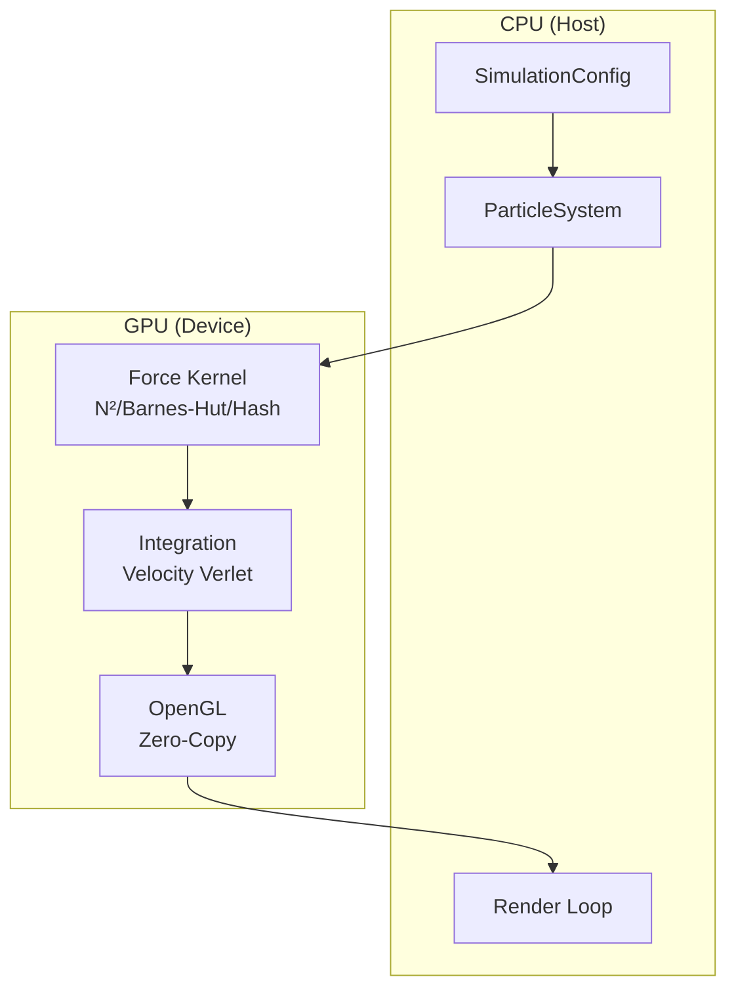

# n-body

[](https://github.com/LessUp/n-body/releases)
[](LICENSE)
[](https://developer.nvidia.com/cuda-toolkit)
[](https://en.cppreference.com/w/cpp/20)
[](https://github.com/LessUp/n-body/actions/workflows/ci.yml)
[](https://lessup.github.io/n-body/)

**Million-Particle GPU Physics Engine** — High-performance N-body simulation with CUDA acceleration, real-time OpenGL visualization, and three force calculation algorithms.

[GitHub Pages](https://lessup.github.io/n-body/) · [Getting Started](docs/setup/getting-started.md) · [Examples](examples/) · [OpenSpec](openspec/specs/)

## Why this project

This project combines three force-computation strategies with a single simulation/runtime API:

- **Direct N²** for exact pairwise reference results
- **Barnes-Hut** for scalable long-range approximation
- **Spatial Hash** for efficient short-range interaction
- **Velocity Verlet** for stable symplectic integration
- **CUDA/OpenGL interop** for zero-copy visualization

The goal is not just to render particles quickly, but to keep the simulation architecture understandable, testable, and easy to compare across algorithms.

## Performance Highlights

| Particles | Direct N² | Barnes-Hut | Spatial Hash |
|-----------|-----------|------------|--------------|
| 10K | 60 FPS | 120 FPS | 120 FPS |
| 100K | 10 FPS | 60 FPS | 90 FPS |
| 1M | 1 FPS | 25 FPS | 60 FPS |

*Benchmarks on NVIDIA RTX 3080*

## Architecture



## Technical Highlights

| Area | What it provides |
|------|------------------|
| Compute | CUDA kernels for force evaluation and integration |
| Algorithms | Direct N², Barnes-Hut, Spatial Hash |
| Rendering | OpenGL renderer with CUDA/OpenGL interop |
| Architecture | `ParticleSystem` facade + `ForceCalculator` strategy |
| Quality | GoogleTest + RapidCheck, OpenSpec-driven workflow |

## Algorithm Guide

| Algorithm | Complexity | Best fit |
|-----------|------------|----------|
| Direct N² | O(N²) | Small systems, reference validation |
| Barnes-Hut | O(N log N) | Large gravitational systems |
| Spatial Hash | O(N) | Short-range interaction workloads |

## Quick Start

### Requirements

- NVIDIA GPU with CUDA support
- CUDA Toolkit 11+
- CMake 3.18+
- OpenGL, GLFW, GLEW, GLM
- For a headless core-only validation path, disable CUDA/rendering; headless observability tests and benchmarks still work.

### Build

```bash
./scripts/build.sh
```

When CUDA is unavailable, the script now falls back to a headless core-only build and still produces the core library, headless observability tests, and the benchmark executable. Rendered app surfaces and examples remain disabled.

Manual path:

```bash
mkdir -p build
cd build
cmake .. -DCMAKE_BUILD_TYPE=Release
cmake --build . -j"$(nproc)"
```

### Run

```bash
./build/nbody_sim
./build/nbody_sim 100000
```

### Test

```bash
./scripts/test.sh
```

### Benchmark

```bash
./scripts/benchmark.sh
./scripts/benchmark.sh serialization.round_trip build/benchmark-results.json
```

## Project Layout

| Path | Purpose |
|------|---------|
| `include/nbody/` | Public headers |
| `src/` | Core, CUDA, rendering, utilities |
| `tests/` | Unit and property-based tests |
| `examples/` | Example programs and usage patterns |
| `docs/` | Canonical repository-local documentation |
| `site/` | GitHub Pages showcase |
| `openspec/specs/` | Active specifications |
| `openspec/changes/` | Active proposals and implementation tasks |

## Canonical Documentation

- [Getting Started](docs/setup/getting-started.md)
- [Architecture](docs/architecture/architecture.md)
- [Algorithms](docs/architecture/algorithms.md)
- [API Reference](docs/architecture/api.md)
- [Performance](docs/architecture/performance.md)
- [Contributing](CONTRIBUTING.md)

## Examples

- [`example_basic.cpp`](examples/example_basic.cpp)
- [`example_force_methods.cpp`](examples/example_force_methods.cpp)
- [`example_custom_distribution.cpp`](examples/example_custom_distribution.cpp)
- [`example_energy_conservation.cpp`](examples/example_energy_conservation.cpp)

## Development Notes

- Canonical build path: CMake + `scripts/build.sh`
- Canonical LSP baseline: `clangd` + `compile_commands.json`
- Canonical assistant guidance: [AGENTS.md](AGENTS.md), [CLAUDE.md](CLAUDE.md), [.github/copilot-instructions.md](.github/copilot-instructions.md)

## Citation

If you use this project in your research, please cite:

```bibtex
@software{nbody2026,
  title = {N-Body: Million-Particle GPU Physics Engine},
  author = {LessUp},
  year = {2026},
  url = {https://github.com/LessUp/n-body},
  version = {2.1.0},
  note = {CUDA-accelerated N-body simulation with real-time visualization}
}
```

## License

[MIT](LICENSE)
