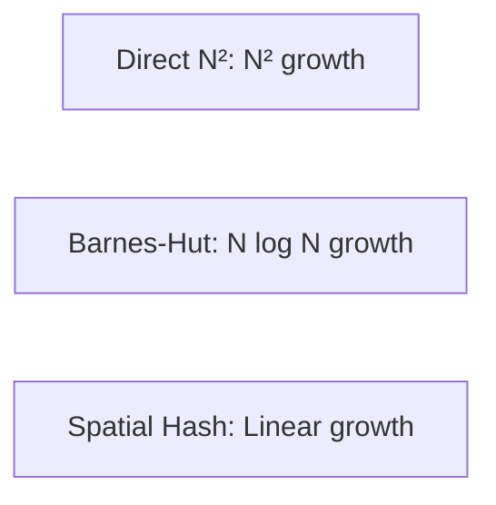

# Algorithm Comparison

Detailed comparison of the three force calculation algorithms.

## Complexity Analysis

| Algorithm | Time | Space | Accuracy |
|-----------|------|-------|----------|
| Direct N² | O(N²) | O(N) | Exact |
| Barnes-Hut | O(N log N) | O(N) | Approximate |
| Spatial Hash | O(N) | O(N) | Approximate |

## Accuracy Comparison

### Direct N²

- Exact pairwise calculation
- Best for validation and small systems
- No approximation error

### Barnes-Hut

- Error controlled by θ parameter
- Typical θ = 0.5 gives ~1% error
- Better accuracy with smaller θ

### Spatial Hash

- Only accurate for short-range forces
- Cutoff radius determines accuracy
- No long-range interactions

## Use Case Matrix

| Scenario | Recommended |
|----------|-------------|
| Galaxy simulation | Barnes-Hut |
| Molecular dynamics | Spatial Hash |
| Small system validation | Direct N² |
| Real-time visualization | Spatial Hash |
| Scientific accuracy | Direct N² |

## Performance Scaling

