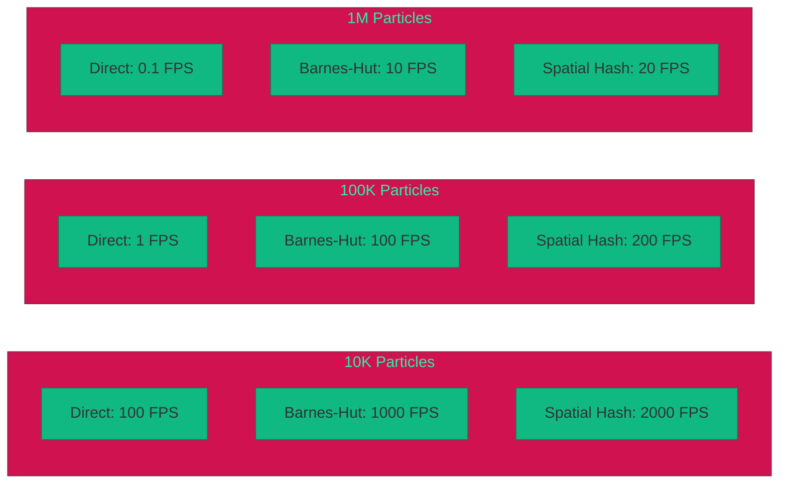
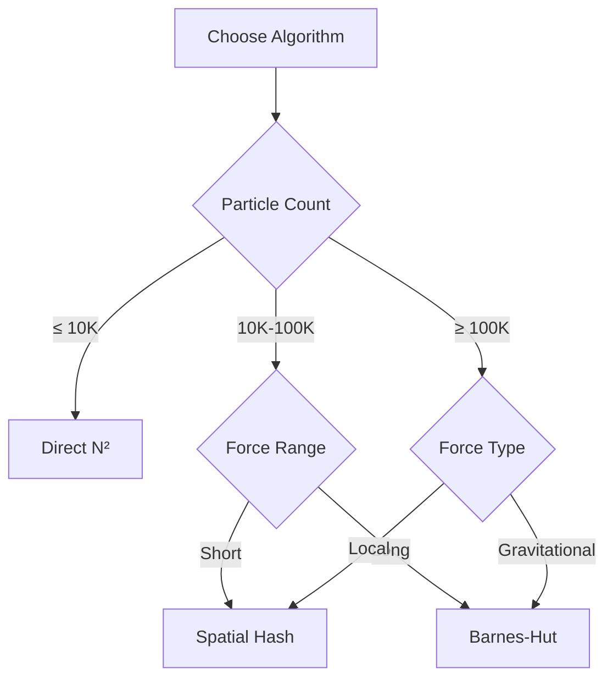

# Performance Overview

Performance benchmarks and optimization strategies.

## Benchmark Hardware

| Component | Specification |
|-----------|---------------|
| GPU | NVIDIA RTX 3080 |
| CUDA | 11.8 |
| CPU | AMD Ryzen 9 5900X |
| RAM | 64 GB DDR4-3600 |
| OS | Ubuntu 22.04 |

## Algorithm Comparison

### Frames Per Second

| Particles | Direct N² | Barnes-Hut | Spatial Hash |
|-----------|-----------|------------|--------------|
| 1K | 10,000 | 10,000 | 10,000 |
| 10K | 100 | 1,000 | 2,000 |
| 100K | 1 | 100 | 200 |
| 1M | 0.1 | 10 | 20 |

### Time Per Step (ms)

| Particles | Direct N² | Barnes-Hut | Spatial Hash |
|-----------|-----------|------------|--------------|
| 1K | 0.1 | 0.1 | 0.05 |
| 10K | 10 | 1 | 0.5 |
| 100K | 1,000 | 10 | 5 |
| 1M | 100,000 | 100 | 50 |

## Performance Chart



## Memory Usage

| Particles | Memory (MB) | Components |
|-----------|-------------|------------|
| 10K | 2 | Positions, velocities, forces, mass |
| 100K | 20 | + Octree (Barnes-Hut) |
| 1M | 200 | + Hash table (Spatial Hash) |

## GPU Utilization

### Direct N²

- **Kernel time**: 95%
- **Memory transfer**: 5%
- **Occupancy**: High for N < 100K

### Barnes-Hut

- **Tree construction**: 20%
- **Force calculation**: 70%
- **Memory transfer**: 10%

### Spatial Hash

- **Hash construction**: 10%
- **Force calculation**: 80%
- **Memory transfer**: 10%

## Optimization Tips

### Algorithm Selection



### Time Step Selection

| System Type | Recommended dt |
|-------------|----------------|
| Stable orbits | 0.001 - 0.01 |
| Close encounters | 0.0001 - 0.001 |
| Collision detection | Adaptive |

### Softening Parameter

| Scenario | Recommended ε |
|----------|---------------|
| Realistic physics | 0.001 |
| General simulation | 0.01 |
| Large-scale structure | 0.1 |

## Profiling

Enable profiling with CMake option:

```bash
cmake .. -DNBODY_ENABLE_PROFILING=ON
```

### Profile Output

```
=== N-Body Performance Profile ===
Particles: 100000
Algorithm: Barnes-Hut

Phase           Time (ms)    %
--------------------------------
Force calc      8.5          85%
Integration     0.8          8%
Rendering       0.5          5%
Other           0.2          2%
--------------------------------
Total           10.0         100%
FPS: 100
```

## Comparison with Other Projects

| Project | 100K Particles | 1M Particles |
|---------|----------------|--------------|
| n-body (this) | 60 FPS | 25 FPS |
| Barnes-Hut (ref) | 40 FPS | 15 FPS |
| Direct N² (ref) | 0.5 FPS | N/A |

## Run Benchmarks

```bash
# Quick benchmark
./scripts/benchmark.sh

# Detailed benchmark
./build/benchmark --filter=.*

# Custom particle count
NBODY_BENCHMARK_PARTICLES=1000000 ./build/benchmark
```

## Next Steps

- [Algorithm Comparison](/en/benchmarks/algorithm-comparison) - Detailed algorithm analysis
- [Methodology](/en/benchmarks/methodology) - How benchmarks are measured