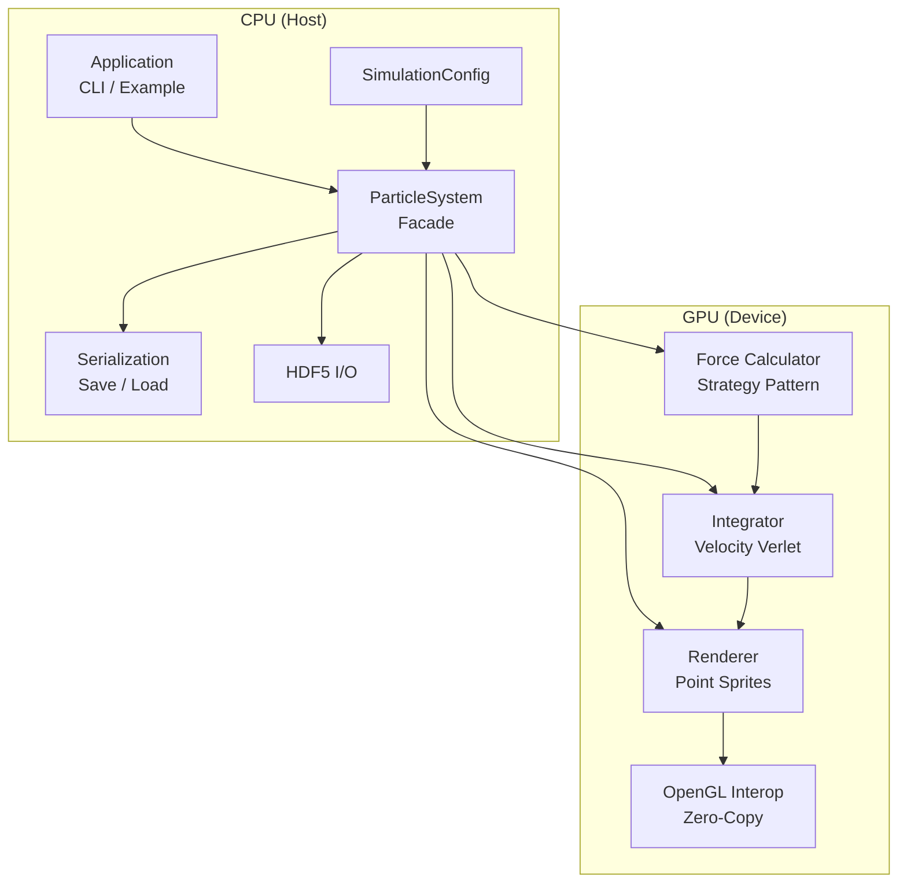
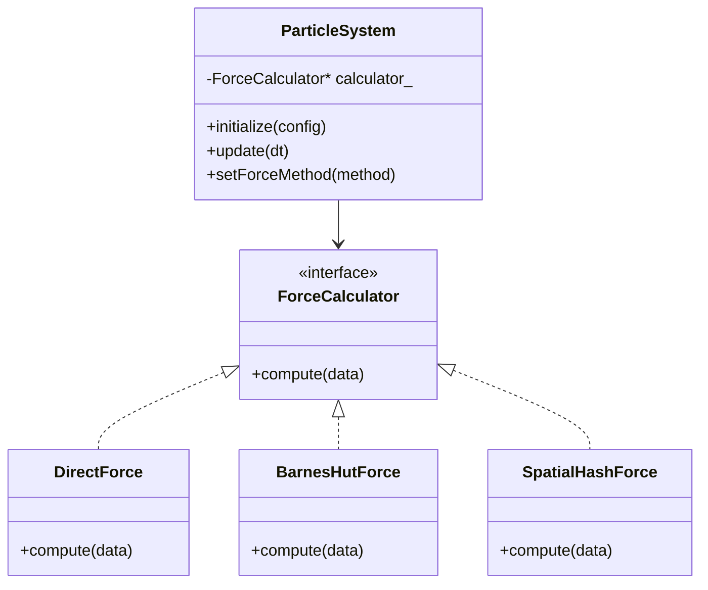
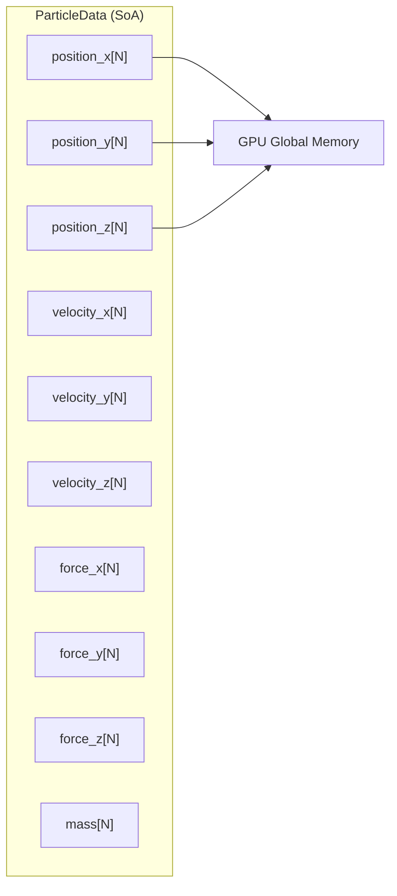
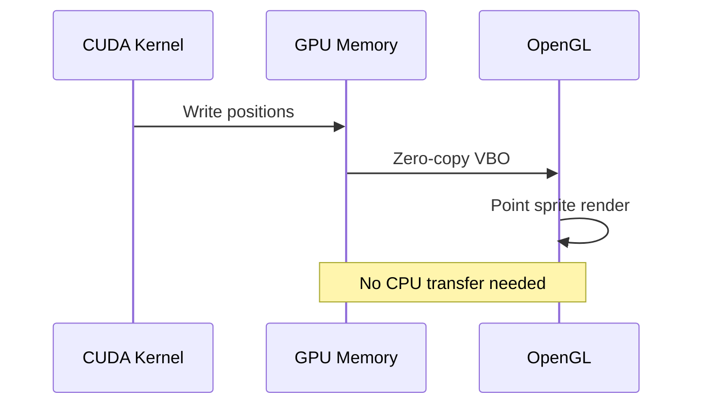
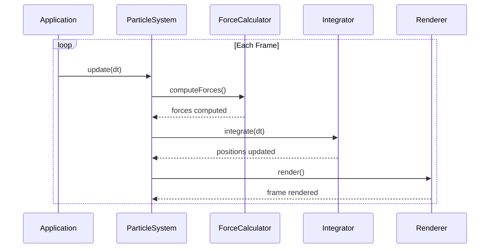

# Architecture

System architecture and design patterns.

## System Overview



## Design Patterns

### Strategy Pattern (Force Calculation)

Runtime algorithm switching through a common interface:



### Bridge Pattern (CUDA-OpenGL)

Decouples CUDA computation from OpenGL rendering:


### Facade Pattern (ParticleSystem)

Simplifies the complex subsystem into a single API:

```cpp
// Without facade
ForceCalculator* calc = ForceCalculator::create(method);
Integrator integrator;
Renderer renderer;
CudaGLInterop interop;
// ... complex wiring ...

// With facade
ParticleSystem system;
system.initialize(config);
system.update(dt);
```

## Memory Architecture

### Structure of Arrays (SoA)

Particle data is stored in SoA layout for GPU memory coalescing:



### Zero-Copy Rendering

CUDA-OpenGL interop shares memory between compute and rendering:



## Simulation Loop



## Component Responsibilities

| Component | Responsibility |
|-----------|---------------|
| `ParticleSystem` | Orchestration, state management |
| `ForceCalculator` | Force computation (strategy) |
| `Integrator` | Time integration (Velocity Verlet) |
| `Renderer` | OpenGL visualization |
| `CudaGLInterop` | GPU memory sharing |
| `Camera` | View control |
| `UIPanel` | Dear ImGui diagnostics |

## Extension Points

### Adding a New Force Method

1. Create a class implementing `ForceCalculator`
2. Add to the `ForceMethod` enum
3. Register in `ForceCalculator::create()`

```cpp
class MyCustomForce : public ForceCalculator {
public:
    void compute(ParticleData& data) override {
        // Custom force computation
    }
};
```

### Adding a New Renderer

1. Create a class implementing the rendering interface
2. Integrate with `CudaGLInterop` for zero-copy
3. Register in the rendering factory

## Source Layout

| Path | Purpose |
|------|---------|
| `src/core/` | ParticleSystem, CLI, algorithm stubs |
| `src/cuda/` | CUDA kernels (force, integration, init) |
| `src/render/` | OpenGL rendering, camera, interop |
| `src/utils/` | Serialization, HDF5, profiling |
| `include/nbody/` | Public headers |
