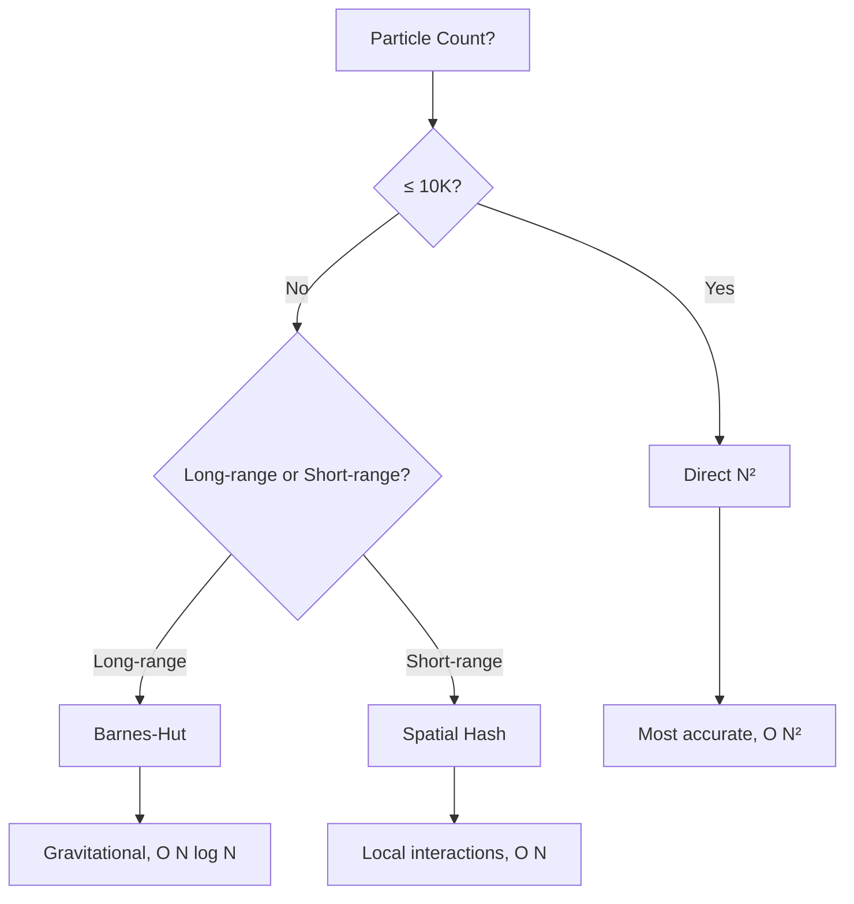

# Quick Start

Get your first N-body simulation running in minutes.

## Basic Simulation

```bash
# Build first (see Installation)
./build/nbody_sim
```

This launches a simulation with 10,000 particles using the Barnes-Hut algorithm.

### Command Line Options

```bash
./build/nbody_sim [particle_count] [options]
```

| Option | Description | Default |
|--------|-------------|---------|
| `particle_count` | Number of particles | 10,000 |
| `--algorithm` | Force method: `direct`, `barnes-hut`, `spatial-hash` | barnes-hut |
| `--distribution` | Initial distribution: `spherical`, `disk`, `cube` | spherical |
| `--dt` | Time step | 0.001 |
| `--softening` | Softening parameter | 0.01 |

### Examples

```bash
# 100K particles with Barnes-Hut
./build/nbody_sim 100000

# 1M particles with Spatial Hash (O(N))
./build/nbody_sim 1000000 --algorithm spatial-hash

# Direct N² for small systems (most accurate)
./build/nbody_sim 5000 --algorithm direct

# Custom time step and softening
./build/nbody_sim 50000 --dt 0.0005 --softening 0.02
```

## Keyboard Controls

When running with visualization:

| Key | Action |
|-----|--------|
| `Space` | Pause/Resume |
| `R` | Reset simulation |
| `1/2/3` | Switch algorithm |
| `G` | Toggle grid |
| `I` | Toggle info panel |
| `Esc` | Exit |

## Mouse Controls

| Action | Function |
|--------|----------|
| Left drag | Rotate camera |
| Right drag | Pan camera |
| Scroll | Zoom in/out |

## Using the C++ API

```cpp
#include "nbody/particle_system.hpp"
#include <iostream>

using namespace nbody;

int main() {
    // Configure simulation
    SimulationConfig config;
    config.particle_count = 100'000;
    config.force_method = ForceMethod::BARNES_HUT;
    config.dt = 0.001f;
    config.softening = 0.01f;
    config.init_distribution = InitDistribution::SPHERICAL;

    // Initialize system
    ParticleSystem system;
    system.initialize(config);

    // Run simulation
    for (int step = 0; step < 10'000; ++step) {
        system.update(config.dt);
        
        // Print progress
        if (step % 1000 == 0) {
            std::cout << "Step " << step 
                      << ", Time: " << system.getTime() 
                      << ", Energy: " << system.getTotalEnergy() 
                      << std::endl;
        }
    }

    return 0;
}
```

## Algorithm Selection Guide



## Performance Expectations

RTX 3080 benchmarks:

| Particles | Direct N² | Barnes-Hut | Spatial Hash |
|-----------|-----------|------------|--------------|
| 10K | 60 FPS | 120 FPS | 120 FPS |
| 100K | 10 FPS | 60 FPS | 90 FPS |
| 1M | 1 FPS | 25 FPS | 60 FPS |

## Next Steps

- [Examples](/en/getting-started/examples) - More code examples
- [Configuration](/en/user-guide/configuration) - All configuration options
- [Algorithms](/en/user-guide/algorithms) - Detailed algorithm explanations