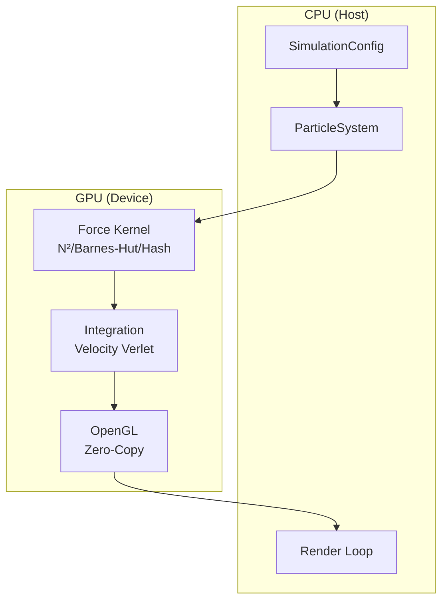

# Million-Particle GPU Physics Engine

High-performance N-body simulation with CUDA acceleration, real-time OpenGL visualization, and three force calculation algorithms.

<div class="stats-grid">
  <div class="stat-item">
    <div class="stat-value">1M+</div>
    <div class="stat-label">Particles</div>
  </div>
  <div class="stat-item">
    <div class="stat-value">60+</div>
    <div class="stat-label">FPS</div>
  </div>
  <div class="stat-item">
    <div class="stat-value">3</div>
    <div class="stat-label">Algorithms</div>
  </div>
</div>

## Algorithms

<div class="algorithm-cards">
  <div class="algorithm-card blue complexity-blue">
    <div class="algorithm-card-header">
      <div class="algorithm-card-name">Direct N²</div>
      <div class="algorithm-card-complexity">O(N²)</div>
    </div>
    <div class="algorithm-card-desc">
      Exact pairwise force calculation. Every particle interacts with every other particle for maximum accuracy.
    </div>
    <div class="algorithm-card-best-for">
      <strong>Best for:</strong> Small systems (≤10K particles), reference validation
    </div>
  </div>

  <div class="algorithm-card green complexity-green">
    <div class="algorithm-card-header">
      <div class="algorithm-card-name">Barnes-Hut</div>
      <div class="algorithm-card-complexity">O(N log N)</div>
    </div>
    <div class="algorithm-card-desc">
      Hierarchical octree approximation. Groups distant particles for efficient long-range force calculation.
    </div>
    <div class="algorithm-card-best-for">
      <strong>Best for:</strong> Large gravitational systems (100K+ particles)
    </div>
  </div>

  <div class="algorithm-card purple complexity-purple">
    <div class="algorithm-card-header">
      <div class="algorithm-card-name">Spatial Hash</div>
      <div class="algorithm-card-complexity">O(N)</div>
    </div>
    <div class="algorithm-card-desc">
      Grid-based short-range force calculation. Linear complexity for localized interactions.
    </div>
    <div class="algorithm-card-best-for">
      <strong>Best for:</strong> Molecular dynamics, particle fluids
    </div>
  </div>
</div>

## Features

<div class="feature-map">
  <div class="feature-card">
    <div class="feature-card-title">⚡ GPU Accelerated</div>
    <div class="feature-card-desc">
      CUDA parallel processing with one thread per particle. Optimized memory access patterns.
    </div>
  </div>

  <div class="feature-card">
    <div class="feature-card-title">🔄 Zero-Copy Rendering</div>
    <div class="feature-card-desc">
      CUDA-OpenGL interop eliminates CPU↔GPU data transfer. Direct GPU memory visualization.
    </div>
  </div>

  <div class="feature-card">
    <div class="feature-card-title">⚖️ Energy Conserving</div>
    <div class="feature-card-desc">
      Velocity Verlet symplectic integration ensures stable long-term simulations.
    </div>
  </div>

  <div class="feature-card">
    <div class="feature-card-title">🎯 Real-time 60+ FPS</div>
    <div class="feature-card-desc">
      Smooth visualization for up to 1 million particles with point sprite rendering.
    </div>
  </div>

  <div class="feature-card">
    <div class="feature-card-title">📦 HDF5 Export</div>
    <div class="feature-card-desc">
      Scientific data export in HDF5 format for analysis and visualization.
    </div>
  </div>

  <div class="feature-card">
    <div class="feature-card-title">🖥️ Cross-Platform</div>
    <div class="feature-card-desc">
      Linux, Windows, macOS with NVIDIA GPU. Headless mode for CI/testing.
    </div>
  </div>
</div>

## Quick Start

<div class="quick-start">
  <div class="quick-start-title">Build and Run</div>
  <div class="quick-start-content">
    <div class="command-block">
      <code>git clone https://github.com/LessUp/n-body.git<br>cd n-body<br>./scripts/build.sh<br>./build/nbody_sim 100000</code>
    </div>
    <p>Requires: NVIDIA GPU with CUDA support, CUDA Toolkit 11+, CMake 3.18+, OpenGL 3.3+</p>
  </div>
</div>

## Architecture



## Performance

| Particles | Direct N² | Barnes-Hut | Spatial Hash |
|-----------|-----------|------------|--------------|
| 10K | 60 FPS | 120 FPS | 120 FPS |
| 100K | 10 FPS | 60 FPS | 90 FPS |
| 1M | 1 FPS | 25 FPS | 60 FPS |

*Benchmarks on NVIDIA RTX 3080*

## Citation

<details class="citation-block">
<summary>BibTeX Citation</summary>

```bibtex
@software{nbody2026,
  title = {N-Body: Million-Particle GPU Physics Engine},
  author = {LessUp},
  year = {2026},
  url = {https://github.com/LessUp/n-body},
  version = {2.1.0},
  note = {CUDA-accelerated N-body simulation with real-time visualization}
}
```

</details>

## Links

- [Getting Started](/en/getting-started/installation) - Installation and setup guide
- [Architecture](/en/developer-guide/architecture) - System design and patterns
- [API Reference](/en/api-reference/particle-system) - Detailed API documentation
- [Benchmarks](/en/benchmarks/performance) - Performance analysis and methodology
- [GitHub](https://github.com/LessUp/n-body) - Source code and issues
