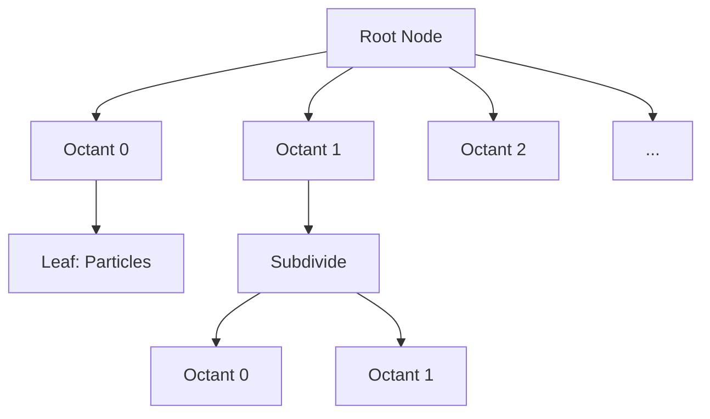

# Algorithms

Detailed explanation of the three force calculation algorithms.

## Direct N²

The most accurate but computationally expensive method.

### Algorithm

For each particle, compute force from all other particles:

$$\vec{F}_i = \sum_{j \neq i} \frac{G m_i m_j}{|\vec{r}_{ij}|^2 + \epsilon^2} \hat{r}_{ij}$$

### CUDA Implementation

```cpp
__global__ void direct_force_kernel(
    const float* __restrict__ pos_x,
    const float* __restrict__ pos_y,
    const float* __restrict__ pos_z,
    const float* __restrict__ mass,
    float* __restrict__ force_x,
    float* __restrict__ force_y,
    float* __restrict__ force_z,
    int n, float softening
) {
    int i = blockIdx.x * blockDim.x + threadIdx.x;
    if (i >= n) return;
    
    float fx = 0, fy = 0, fz = 0;
    float xi = pos_x[i], yi = pos_y[i], zi = pos_z[i];
    
    for (int j = 0; j < n; ++j) {
        if (j == i) continue;
        
        float dx = pos_x[j] - xi;
        float dy = pos_y[j] - yi;
        float dz = pos_z[j] - zi;
        
        float r2 = dx*dx + dy*dy + dz*dz + softening*softening;
        float inv_r3 = rsqrtf(r2) / r2;
        
        float factor = mass[j] * inv_r3;
        fx += dx * factor;
        fy += dy * factor;
        fz += dz * factor;
    }
    
    force_x[i] = fx;
    force_y[i] = fy;
    force_z[i] = fz;
}
```

### Performance

| Particles | Time (ms) | FPS |
|-----------|-----------|-----|
| 1K | 0.1 | 10,000 |
| 10K | 10 | 100 |
| 100K | 1,000 | 1 |

::: warning
Direct N² scales as O(N²). Not recommended for >10K particles.
:::

---

## Barnes-Hut

Hierarchical algorithm for long-range forces.

### Algorithm

1. Build an octree containing all particles
2. For each particle, traverse the tree
3. If a node is far enough, use its center of mass
4. Otherwise, recurse into children

### Multipole Approximation

A node is approximated if:

$$\frac{s}{d} < \theta$$

Where:
- $s$ = node size
- $d$ = distance to particle
- $\theta$ = opening angle (default 0.5)

### Octree Structure



### CUDA Implementation

The Barnes-Hut algorithm has two phases:

1. **Tree Construction** (CPU or GPU)
2. **Force Calculation** (GPU)

```cpp
// Phase 1: Build octree on CPU
Octree tree;
tree.build(particles);

// Phase 2: Compute forces on GPU
__global__ void barnes_hut_force_kernel(
    const OctreeNode* nodes,
    const float* pos_x, ...
) {
    // Traverse tree for each particle
    // Use multipole approximation for distant nodes
}
```

### Performance

| Particles | Time (ms) | FPS |
|-----------|-----------|-----|
| 10K | 1 | 1,000 |
| 100K | 10 | 100 |
| 1M | 100 | 10 |

::: tip
Barnes-Hut is ideal for gravitational simulations with 100K+ particles.
:::

---

## Spatial Hash

Grid-based algorithm for short-range forces.

### Algorithm

1. Hash particle positions into grid cells
2. For each particle, only check neighboring cells
3. Apply cutoff radius for force calculation

### Hash Function

```cpp
__device__ int hash_position(float x, float y, float z, float cell_size, int grid_dim) {
    int ix = floorf(x / cell_size);
    int iy = floorf(y / cell_size);
    int iz = floorf(z / cell_size);
    return (ix * grid_dim * grid_dim + iy * grid_dim + iz) % (grid_dim * grid_dim * grid_dim);
}
```

### Neighbor Search


### CUDA Implementation

```cpp
__global__ void spatial_hash_force_kernel(
    const float* pos_x, ...
    const int* cell_start,
    const int* cell_end,
    float cutoff_radius
) {
    int i = blockIdx.x * blockDim.x + threadIdx.x;
    
    // Get cell indices
    int cx, cy, cz;
    get_cell_indices(pos_x[i], pos_y[i], pos_z[i], cx, cy, cz);
    
    float fx = 0, fy = 0, fz = 0;
    
    // Check 27 neighboring cells
    for (int dx = -1; dx <= 1; ++dx) {
        for (int dy = -1; dy <= 1; ++dy) {
            for (int dz = -1; dz <= 1; ++dz) {
                int cell = hash_cell(cx + dx, cy + dy, cz + dz);
                
                // Iterate particles in cell
                for (int j = cell_start[cell]; j < cell_end[cell]; ++j) {
                    if (j == i) continue;
                    
                    float r = distance(i, j);
                    if (r < cutoff_radius) {
                        // Add force contribution
                    }
                }
            }
        }
    }
}
```

### Performance

| Particles | Time (ms) | FPS |
|-----------|-----------|-----|
| 10K | 0.5 | 2,000 |
| 100K | 5 | 200 |
| 1M | 50 | 20 |

::: tip
Spatial Hash is ideal for molecular dynamics and particle fluids where forces are short-range.
:::

---

## Velocity Verlet Integration

All three force methods use the Velocity Verlet integrator:

$$\vec{x}(t + \Delta t) = \vec{x}(t) + \vec{v}(t) \Delta t + \frac{1}{2} \vec{a}(t) \Delta t^2$$

$$\vec{v}(t + \Delta t) = \vec{v}(t) + \frac{1}{2} [\vec{a}(t) + \vec{a}(t + \Delta t)] \Delta t$$

### Properties

- **Symplectic**: Conserves energy over long periods
- **Time-reversible**: Can run backwards
- **Second-order**: O(Δt²) error

### Energy Conservation

```cpp
// Monitor energy drift
double E0 = system.getTotalEnergy();

for (int i = 0; i < 10000; ++i) {
    system.update(0.001);
}

double E1 = system.getTotalEnergy();
double drift = abs(E1 - E0) / abs(E0);
// Typically < 0.01% for stable systems
```
