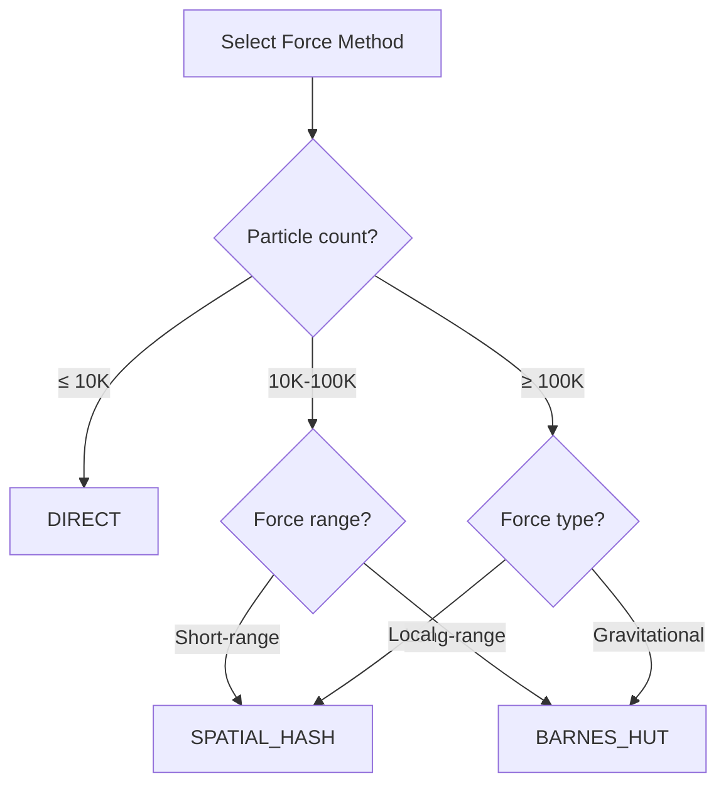

# Configuration

Complete reference for simulation configuration options.

## SimulationConfig

The `SimulationConfig` structure controls all aspects of the simulation:

```cpp
struct SimulationConfig {
    // Particle setup
    int particle_count = 10000;
    InitDistribution init_distribution = InitDistribution::SPHERICAL;
    
    // Force calculation
    ForceMethod force_method = ForceMethod::BARNES_HUT;
    float softening = 0.01f;
    
    // Integration
    float dt = 0.001f;
    
    // Rendering
    bool enable_rendering = true;
    int window_width = 1280;
    int window_height = 720;
    
    // Diagnostics
    bool enable_profiling = false;
    bool enable_energy_monitor = false;
};
```

## Force Methods

### ForceMethod Enum

| Value | Description | Complexity |
|-------|-------------|------------|
| `ForceMethod::DIRECT` | Exact pairwise | O(N²) |
| `ForceMethod::BARNES_HUT` | Hierarchical octree | O(N log N) |
| `ForceMethod::SPATIAL_HASH` | Grid-based local | O(N) |

### Selection Guide



## Initial Distributions

### InitDistribution Enum

| Value | Description | Use case |
|-------|-------------|----------|
| `InitDistribution::SPHERICAL` | Uniform sphere | Galaxy clusters |
| `InitDistribution::DISK` | Thin disk with rotation | Spiral galaxies |
| `InitDistribution::CUBE` | Uniform cube | General testing |
| `InitDistribution::RANDOM` | Random positions | Stress testing |

### Custom Distribution

```cpp
// Create particle data manually
ParticleData data;
data.resize(1000);

for (size_t i = 0; i < 1000; ++i) {
    // Set positions, velocities, masses
    data.position_x[i] = /* ... */;
    data.velocity_x[i] = /* ... */;
    data.mass[i] = 1.0f;
}

ParticleSystem system;
system.initialize(data, ForceMethod::BARNES_HUT);
```

## Softening Parameter

The softening parameter prevents singularities when particles get very close:

$$F = \frac{G m_1 m_2}{(r^2 + \epsilon^2)^{3/2}}$$

| Value | Effect |
|-------|--------|
| 0.001 | Minimal smoothing, realistic close encounters |
| 0.01 | Default, balanced accuracy and stability |
| 0.1 | Heavy smoothing, stable but less accurate |
| 1.0 | Very smooth, suitable for large-scale structure |

## Time Step

The time step (`dt`) controls simulation accuracy and speed:

| Value | Trade-off |
|-------|-----------|
| 0.0001 | High accuracy, slow progression |
| 0.001 | Default, good balance |
| 0.01 | Fast but may diverge |
| 0.1 | Likely unstable for most systems |

::: tip
The Velocity Verlet integrator is symplectic, meaning it conserves energy over long periods. However, too large a time step can still cause instability. Monitor total energy to verify stability.
:::

## Runtime Control

### Pause/Resume

```cpp
system.pause();
// ... inspect state ...
system.resume();
```

### Algorithm Switching

Switch algorithms at runtime without reinitializing:

```cpp
system.setForceMethod(ForceMethod::SPATIAL_HASH);
```

### State Checkpoints

```cpp
// Save state
system.saveState("checkpoint.nbody");

// Load state
system.loadState("checkpoint.nbody");
```

## HDF5 Export

```cpp
// Export to HDF5
system.exportHDF5("simulation_output.h5");

// HDF5 file contains:
// - /particles/positions
// - /particles/velocities
// - /particles/masses
// - /metadata/config
// - /metadata/timestamp
```

Read with Python:

```python
import h5py

with h5py.File('simulation_output.h5', 'r') as f:
    positions = f['/particles/positions'][:]
    velocities = f['/particles/velocities'][:]
    masses = f['/particles/masses'][:]
```
