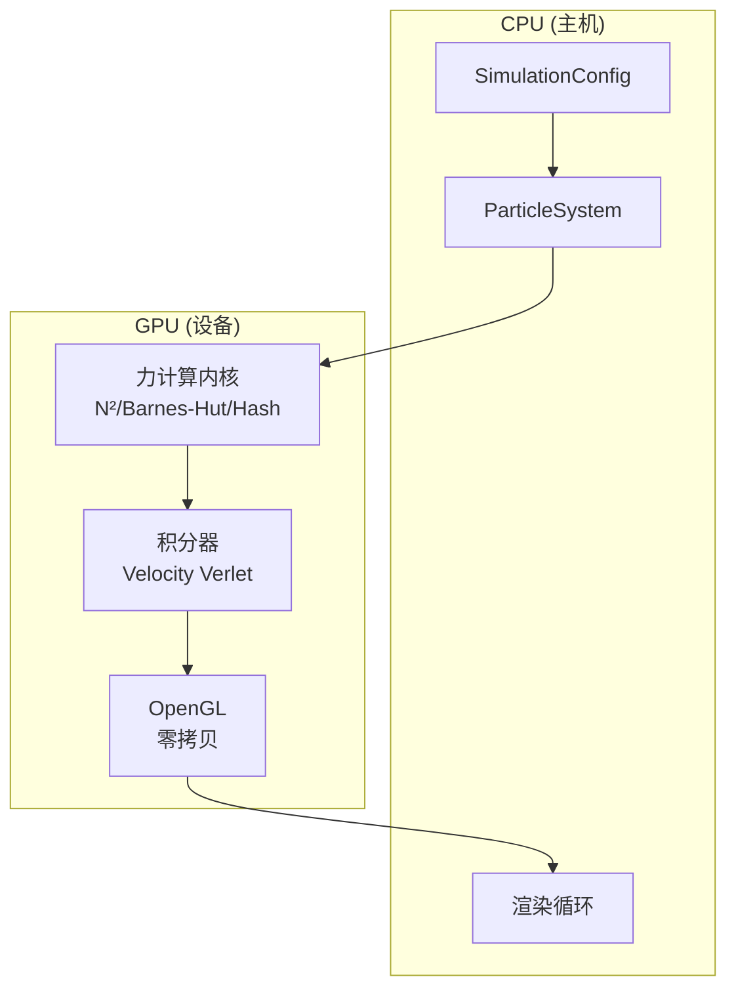

# 百万粒子 GPU 物理引擎

高性能 N-body 粒子模拟，支持 CUDA 加速、实时 OpenGL 可视化，以及三种力计算算法。

<div class="stats-grid">
  <div class="stat-item">
    <div class="stat-value">1M+</div>
    <div class="stat-label">粒子数</div>
  </div>
  <div class="stat-item">
    <div class="stat-value">60+</div>
    <div class="stat-label">FPS</div>
  </div>
  <div class="stat-item">
    <div class="stat-value">3</div>
    <div class="stat-label">算法</div>
  </div>
</div>

## 算法

<div class="algorithm-cards">
  <div class="algorithm-card blue complexity-blue">
    <div class="algorithm-card-header">
      <div class="algorithm-card-name">直接 N²</div>
      <div class="algorithm-card-complexity">O(N²)</div>
    </div>
    <div class="algorithm-card-desc">
      精确的成对力计算。每个粒子与其他所有粒子进行交互，确保最高精度。
    </div>
    <div class="algorithm-card-best-for">
      <strong>适用场景：</strong>小规模系统（≤1万粒子）、参考验证
    </div>
  </div>

  <div class="algorithm-card green complexity-green">
    <div class="algorithm-card-header">
      <div class="algorithm-card-name">Barnes-Hut</div>
      <div class="algorithm-card-complexity">O(N log N)</div>
    </div>
    <div class="algorithm-card-desc">
      层次八叉树近似。将远距离粒子分组，高效计算长程力。
    </div>
    <div class="algorithm-card-best-for">
      <strong>适用场景：</strong>大型引力系统（10万+粒子）
    </div>
  </div>

  <div class="algorithm-card purple complexity-purple">
    <div class="algorithm-card-header">
      <div class="algorithm-card-name">空间哈希</div>
      <div class="algorithm-card-complexity">O(N)</div>
    </div>
    <div class="algorithm-card-desc">
      基于网格的短程力计算。局部交互实现线性复杂度。
    </div>
    <div class="algorithm-card-best-for">
      <strong>适用场景：</strong>分子动力学、粒子流体
    </div>
  </div>
</div>

## 特性

<div class="feature-map">
  <div class="feature-card">
    <div class="feature-card-title">⚡ GPU 加速</div>
    <div class="feature-card-desc">
      CUDA 并行处理，每个粒子一个线程。优化的内存访问模式。
    </div>
  </div>

  <div class="feature-card">
    <div class="feature-card-title">🔄 零拷贝渲染</div>
    <div class="feature-card-desc">
      CUDA-OpenGL 互操作，消除 CPU↔GPU 数据传输。直接 GPU 内存可视化。
    </div>
  </div>

  <div class="feature-card">
    <div class="feature-card-title">⚖️ 能量守恒</div>
    <div class="feature-card-desc">
      Velocity Verlet 辛积分器确保长期模拟稳定性。
    </div>
  </div>

  <div class="feature-card">
    <div class="feature-card-title">🎯 实时 60+ FPS</div>
    <div class="feature-card-desc">
      高达 100 万粒子的流畅可视化，使用点精灵渲染。
    </div>
  </div>

  <div class="feature-card">
    <div class="feature-card-title">📦 HDF5 导出</div>
    <div class="feature-card-desc">
      以 HDF5 格式导出科学数据，便于分析和可视化。
    </div>
  </div>

  <div class="feature-card">
    <div class="feature-card-title">🖥️ 跨平台</div>
    <div class="feature-card-desc">
      支持 Linux、Windows、macOS（需 NVIDIA GPU）。无头模式支持 CI/测试。
    </div>
  </div>
</div>

## 快速开始

<div class="quick-start">
  <div class="quick-start-title">构建与运行</div>
  <div class="quick-start-content">
    <div class="command-block">
      <code>git clone https://github.com/LessUp/n-body.git<br>cd n-body<br>./scripts/build.sh<br>./build/nbody_sim 100000</code>
    </div>
    <p>依赖：NVIDIA GPU（支持 CUDA）、CUDA Toolkit 11+、CMake 3.18+、OpenGL 3.3+</p>
  </div>
</div>

## 架构



## 性能

| 粒子数 | 直接 N² | Barnes-Hut | 空间哈希 |
|--------|---------|------------|----------|
| 1万 | 60 FPS | 120 FPS | 120 FPS |
| 10万 | 10 FPS | 60 FPS | 90 FPS |
| 100万 | 1 FPS | 25 FPS | 60 FPS |

*基准测试环境：NVIDIA RTX 3080*

## 引用

<details class="citation-block">
<summary>BibTeX 引用格式</summary>

```bibtex
@software{nbody2026,
  title = {N-Body: Million-Particle GPU Physics Engine},
  author = {LessUp},
  year = {2026},
  url = {https://github.com/LessUp/n-body},
  version = {2.1.0},
  note = {CUDA-accelerated N-body simulation with real-time visualization}
}
```

</details>

## 链接

- [入门指南](/zh-CN/getting-started/installation) - 安装和设置指南
- [架构设计](/zh-CN/developer-guide/architecture) - 系统设计和模式
- [API 参考](/zh-CN/api-reference/particle-system) - 详细 API 文档
- [性能基准](/zh-CN/benchmarks/performance) - 性能分析和测试方法
- [GitHub](https://github.com/LessUp/n-body) - 源代码和问题反馈
